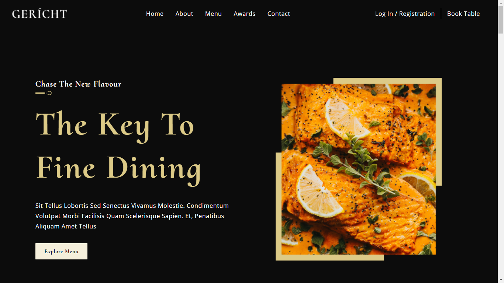
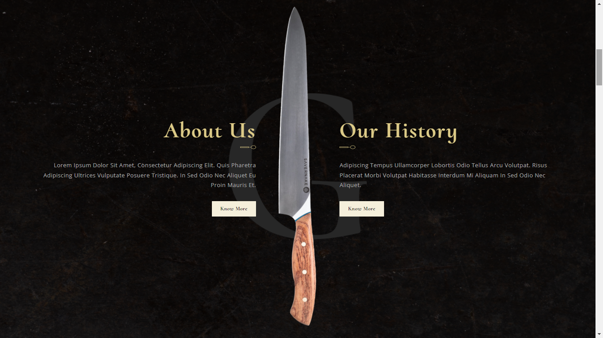
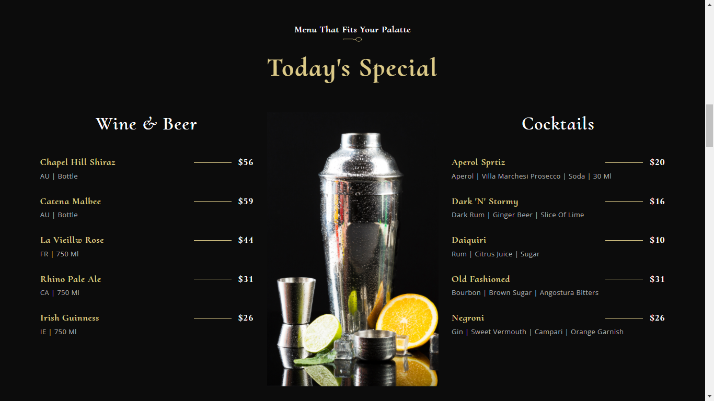
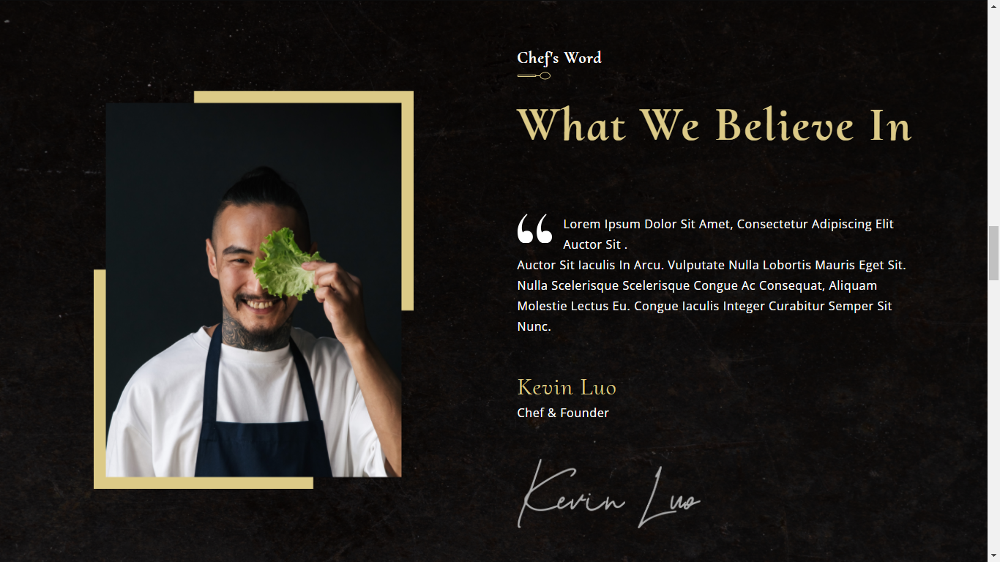
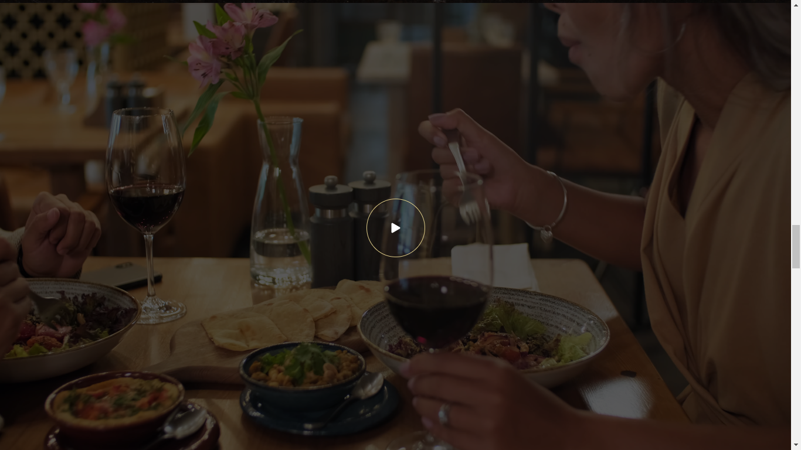
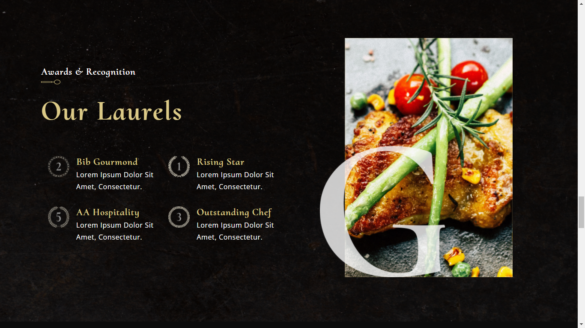
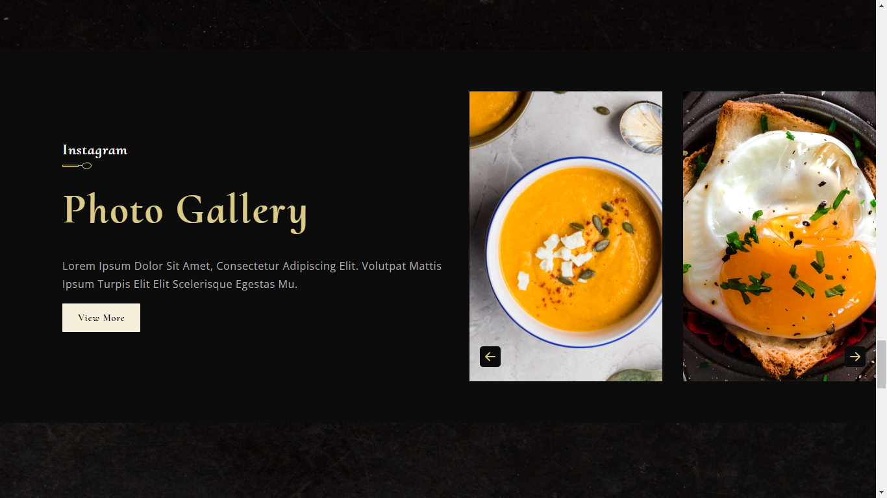
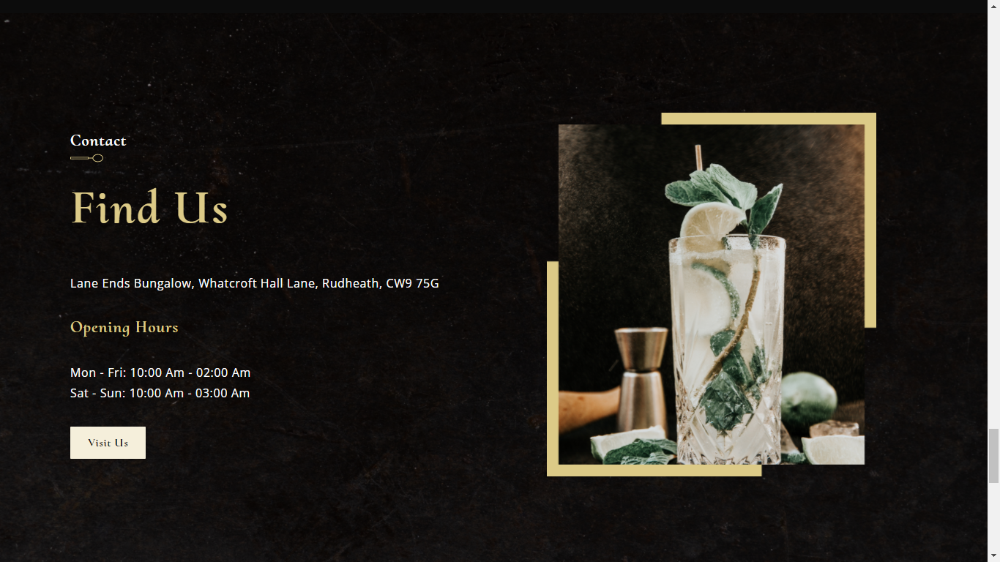
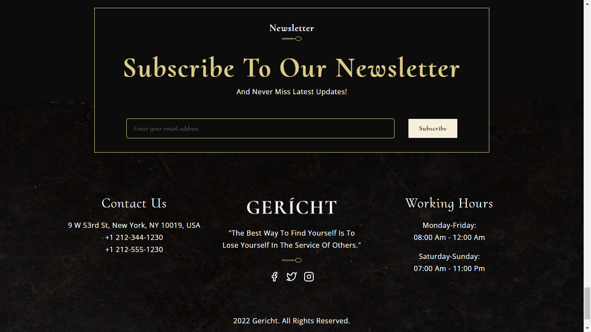

# Gericht 
### [Live Site](https://gericht-restaurant-prakshh.netlify.app/)

## Introduction
This is a code repository for the Modern UI/UX Restaurant Website, nasmed as 'Gericht'

## Features
- React Functional components and their reusability
- React file and folder structure
- Fundamental CSS properties to master flex & grid
- Fundamentals of the CSS BEM Model
- From soft and pleasant animations to complex gradients
- Perfectly placed media queries for satisfactory responsiveness covering almost devices
- Deployed the website to Netlify

